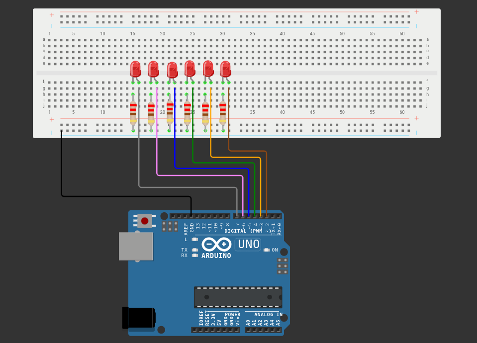

# bare-metal-binary-counter
Simple bare-metal version of a 6 bit binary counter with LEDs. Written in C for the ATmega328P.

[Wokwi](https://wokwi.com/projects/352343869827793921) can be accessed for a simulation.

## Circuit Diagram

